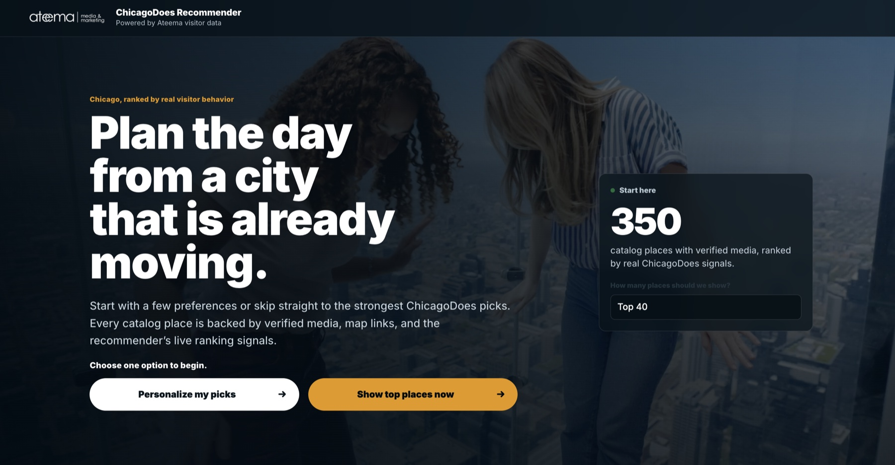
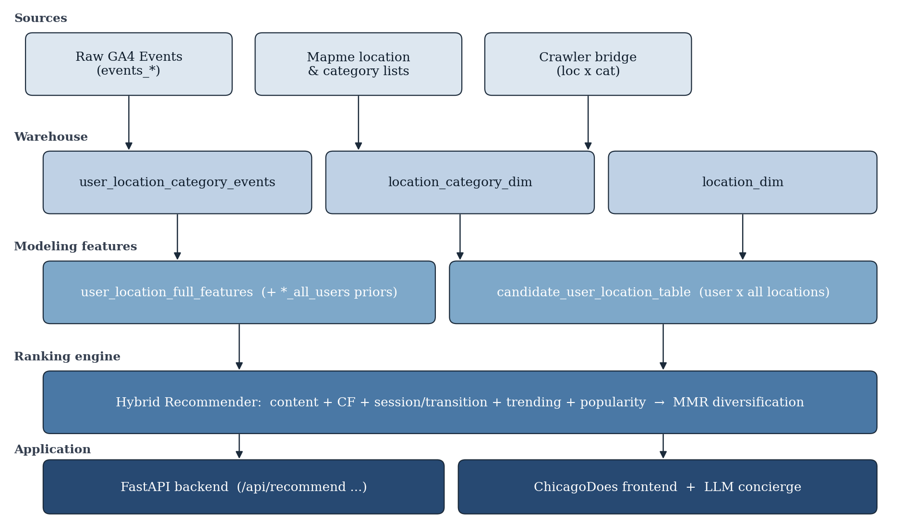

# ChicagoDoes Recommender

**From a few preferences to a personalized day in Chicago.**

A University of Chicago **MS in Applied Data Science capstone** for
**Ateema / ChicagoDoes · Spring 2026**.

Chicago has no shortage of places to go. The harder question is which ones fit
this visitor, right now. This project connects behavioral analytics, a
350-place catalog, and a hybrid recommendation engine to help answer that
question—from BigQuery transformations to an interactive trip-planning experience.

[](https://github.com/AustinWang98/ateema-tourist-attractions-recommender/actions/workflows/ci.yml)


[Try the local demo](#run-locally) ·
[Read the paper](docs/paper/ChicagoDoes_Capstone_Paper.pdf) ·
[View the slides](docs/presentation/ChicagoDoes_Final_Presentation.pptx) ·
[Explore the implementation](docs/TECHNICAL_GUIDE.md)



*Original capstone interface, shown for product context. The public demo uses
synthetic behavior; original photography and video assets are not bundled, so
its appearance may differ.*

**Public data note:** Due to data privacy requirements, the public version of
this project uses synthetic/demo data rather than the original production
dataset used during the capstone. The BigQuery SQL and schemas, algorithms,
evaluation tools, backend, and frontend remain available. The final paper and
slides are included unchanged.

## What we built

A visitor can **personalize their picks** with interests, travel style, and
preferences—or jump straight to top places. Ranked cards explain why each
place appears, link to maps, and support an optional day itinerary.

Behind that experience, the project brings together three kinds of work:

- **Data engineering:** six BigQuery SQL stages and eight table schemas turn
  GA4-style events into catalog dimensions, behavioral features, and candidate
  data.
- **Recommendation science:** six complementary scoring signals, cold-start
  profiles, and diversity re-ranking address sparse histories and repetitive
  recommendations.
- **Product engineering:** FastAPI, a JavaScript frontend, explainable results,
  deterministic planning fallbacks, container configuration, and automated tests
  connect the model to a usable application.

## Run locally

Requires **Python 3.11** and Git. No BigQuery credentials or LLM API key are
needed for the public demo.

```bash
git clone https://github.com/AustinWang98/ateema-tourist-attractions-recommender.git
cd ateema-tourist-attractions-recommender
python3.11 -m venv .venv
source .venv/bin/activate
python -m pip install -r requirements.txt
cp .env.example .env
uvicorn backend.main:app --reload --port 8000
```

Open [the app](http://localhost:8000). On Windows, use `py -3.11` to create the
environment, `.venv\Scripts\Activate.ps1` to activate it in PowerShell, and
`Copy-Item .env.example .env` for the copy step.

**A two-minute walkthrough**

1. Choose **Personalize my picks**, set your traveler type, vibe, and interests,
   then select **Show my places**.
2. Explore the ranked cards and their recommendation explanations.
3. Click the Ateema logo to return home, then choose **Show top places now**
   to compare the preference-free experience.
4. Explore request and response schemas in
   [the interactive API docs](http://localhost:8000/docs), or check
   [service status](http://localhost:8000/api/health).

The checked-in fixture contains **1,920 events across 80 synthetic users** and
uses the same 350-place catalog. It demonstrates the workflow, not the original
visitor distribution or capstone performance.
See the [technical guide](docs/TECHNICAL_GUIDE.md) for configuration, tests,
evaluation, and private warehouse setup.

## Design choices that matter

| Challenge | Design decision | Explore the code |
| --- | --- | --- |
| Little or no visitor history | Build a preference-based profile and behavioral archetype; use separate new/returning-user weights | [Hybrid ranker](backend/recommender.py) |
| No single signal tells the whole story | Blend content, popularity, item co-visitation, user neighbors, session/transition behavior, and trending | [Collaborative models](backend/collab.py) · [Behavioral signals](backend/behavior.py) |
| Relevant lists can still feel repetitive | Apply Maximal Marginal Relevance (MMR) and measure the relevance–diversity tradeoff | [Ranking and MMR](backend/recommender.py) · [Recorded study](data/best_weights.json) |
| Recommendations can influence their own future training data | Log recommender-origin outbound clicks separately and provide a configurable feedback guard | [API and click logging](backend/main.py) · [Configuration](.env.example) |
| A usable demo should not require private infrastructure | Fall back to synthetic events and deterministic itinerary generation when external services are not configured | [Data loading](backend/data_loader.py) · [Application lifecycle](backend/main.py) |

### From events to an experience

```text
GA4-style events + place catalog
              ↓
BigQuery SQL → dimensions and behavioral features
              ↓
Six-signal hybrid ranking → MMR diversity re-ranking
              ↓
FastAPI → ranked cards, explanations, and optional itinerary
```

The browser communicates with the API, not directly with BigQuery. For local
exploration, synthetic CSV events supply the behavioral input without a cloud
warehouse.

Deterministic ranking supplies the core recommendation pool. The optional LLM
assembles an itinerary and can suggest labeled supplementary stops; it does
not replace the ranking algorithm. A deterministic scheduler works without
an API key.

<details>
<summary>Open the full architecture diagram and signal breakdown</summary>



| Scoring signal | What it contributes |
| --- | --- |
| Content similarity | TF-IDF cosine similarity between a visitor profile and place-category tokens |
| Popularity | Distinct-user and engagement priors |
| Item-item collaborative filtering | Co-visitation patterns between places |
| User-user neighbors | Signals from visitors with similar category profiles |
| Session and transition behavior | Same-session co-visitation and previous-to-next movement |
| Trending | Recent engagement relative to an earlier time window |

MMR is applied after score blending to balance relevance and variety.
See the [warehouse runbook](warehouse/README.md), [schemas](warehouse/schemas/),
and [paper source](docs/paper/main.tex) for the full implementation context.

</details>

## Evaluation highlights

These are **offline capstone experiments**, not live conversion metrics or
results from the synthetic demo. NDCG measures how well relevant items appear
near the top of a ranking; intra-list diversity measures variety within it.

| Question | Recorded finding | Evidence |
| --- | --- | --- |
| Can tuning improve held-out ranking quality? | Five-fold validation: NDCG@20 **0.2479 → 0.2557 (+3.2%)**, with wins in **3 of 5 folds** | [Robust-validation summary](data/robust_weights.json) |
| What does greater variety cost? | With MMR, diversity **0.2769 → 0.6038**, while NDCG@10 decreased **0.2559 → 0.2402** | [MMR study](data/best_weights.json) |
| How broadly were weights explored? | **4,004 configurations** retained: 4,000 random samples plus four anchors | [Search results](data/weight_search_results.csv) · [Search implementation](backend/weight_search.py) |

The robust-validation study covered **120 returning users** from approximately
three weeks of activity. Confidence intervals overlap, and this study does not
establish cold-start quality or online business impact. See the
[final paper](docs/paper/ChicagoDoes_Capstone_Paper.pdf) for the methodology and
limitations.

**Configuration matters:** these tuning artifacts are research outputs. The
app's active weights are defined in
[`backend/recommender.py`](backend/recommender.py); it does not automatically
load the saved best/robust weight files. Other saved experiments, including
[`weight_cv_results.csv`](data/weight_cv_results.csv), belong to separate runs
and should not be combined with the figures above.

## Paper, slides, and technical deep dives

| If you want to… | Start here |
| --- | --- |
| Understand the problem, methods, and findings | [Complete final paper — PDF](docs/paper/ChicagoDoes_Capstone_Paper.pdf) |
| Get the presentation-length story | [Final presentation — PPTX](docs/presentation/ChicagoDoes_Final_Presentation.pptx) |
| Inspect the data model and transformations | [BigQuery SQL](warehouse/sql/) · [Eight schemas](warehouse/schemas/) · [Warehouse inventory](warehouse/INVENTORY.md) |
| Run tests, evaluate, or connect your own warehouse | [Technical guide](docs/TECHNICAL_GUIDE.md) |
| Explore the application | [Backend](backend/) · [Frontend](frontend/) · [CI workflow](.github/workflows/ci.yml) |
| Work with the editable academic materials | [DOCX manuscript](docs/paper/ChicagoDoes_Capstone_Paper.docx) · [LaTeX and figures](docs/paper/) · [Presentation source and assets](docs/presentation/) |

## Team and conversation

**Capstone team:** Yiou Wang (project lead) · RJ Xia · Kennedy Damtse

Built for Ateema / ChicagoDoes through the University of Chicago MS in Applied
Data Science program.

Questions about the system, research, or collaboration are welcome:
[Yiou (Austin) Wang · yiouwang@uchicago.edu](mailto:yiouwang@uchicago.edu).

## Public data and privacy

Production credentials, visitor-level analytics exports, and private operational
handoff materials are excluded from the public edition. Operational project and
dataset identifiers are parameterized; the demo uses synthetic identities and
reserved `.invalid` event URLs.

The paper and slides remain unchanged as the historical academic record,
including authorship, aggregate results, and technical narrative. See
[PRIVACY.md](PRIVACY.md) for the release boundary and
[SECURITY.md](SECURITY.md) for secret handling and vulnerability reporting.

## Internal handoff access

Authorized project stakeholders who need **full handoff documentation, original
data, deployment details, private configuration, or internal repository history**
can request access to the private team repository by contacting
[Yiou (Austin) Wang at yiouwang@uchicago.edu](mailto:yiouwang@uchicago.edu).
Please do not post credentials or visitor-level data in public issues.

## License

No open-source license is currently provided. Copyright remains with the
project owners and contributors.
